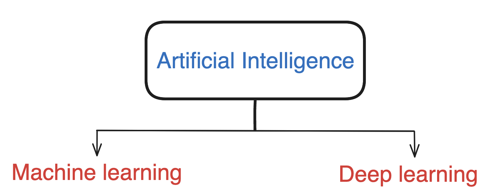
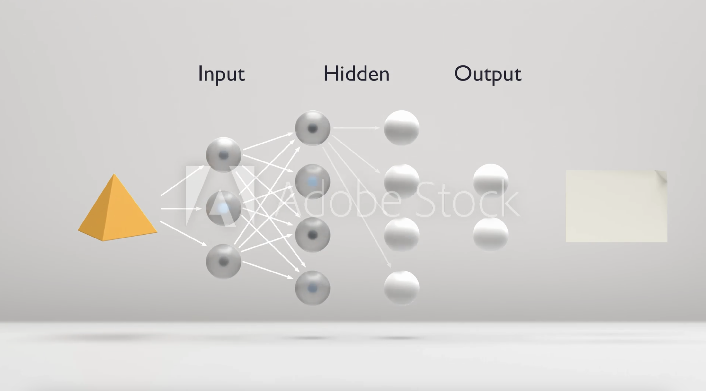
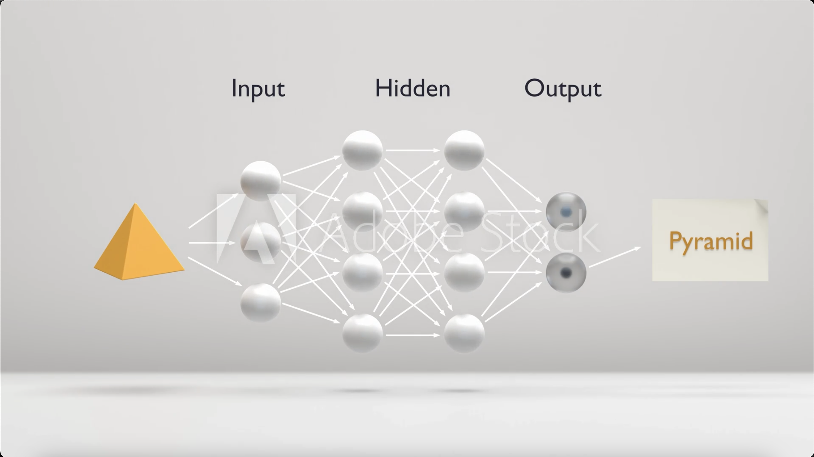

# Introduction to Neural Network and Deep learning.

Greetings to you all! Today, I am here to share some of my learning journey towards neural networks. I hope you all will join me in exploring the fascinating world of deep learning. Let's dive into the basics of neural networks and how they are transforming the landscape of artificial intelligence. Let's get started.

## What is Artificial Intelligence(AI)?

**Artificial Intelligence** is a bulk of programs that has the ablity to mimic the humans interactions. 
 
I have explored some concepts on how it differs from machine learning, and the foundational structure of neural networks.
 
### Basically there are two subsets of AI.

**Machine learning (ML)** is a subset of AI that uses algorithms to learn from data and make predictions, requiring manual feature extraction and being best suited for structured data. 

On the contrary, the **Deep Learning(DL)** is a subset of ML, which uses artificial neural networks to automatically learn from unstructured data, making it capable of handling complex tasks like images and speech recognition.

**Deep Learning** is also a field that computes complex mathematical problems and applies techniques  to solve complex problems to train AI models. 

### Lets dive into Neural Networks.
Neural networks are like our human brain's network of interconnected neurons, which are designed in such a way to mimic how our human  processes their  information. Neural networks are composed up of three main parts:
1. Input layer
2. Hidden layers,
3. Output layer. 

### How neural networks predicts the outcome:
#### Prediction of input.

#### Output.

##### [For better understanding on Neural Networks, Let's watch a short video.](https://v.ftcdn.net/02/89/69/83/240_F_289698304_0YIIGyNxFFQzjJmkUnBATeEew9tnZSDQ_ST.mp4)
**A simple explanation of the above mechanism.**

1. The **Input Layer** is the starting point. It's where we feed in our data, which could be anything from pictures, words or numbers. This layer doesn't do much on its own, it's just there to receive the data and send it on to the next part of the network.

2. The **Hidden Layers** are where all the magic happens. These layers take the data from the input layer and do some math calculation with it. They use something called weights, which are like the strength of the connection between neurons, and a bias, which is like an adjustment factor. They then pass this through an activation function, which decides whether a neuron should be activated or not. Out of many activation functions, I have learned two types of activation function namely ‘Relu’ and ‘sigmoid’ function.  This process helps the network learn from the data and solve complex problems.

3. The **Output Layer** is the final step. It takes the processed data from the hidden layers and gives us the final answer. Example like whether it's predicting what kind of animal picture it is  or telling us if an email is spam, the output layer is what we look at to get our result.

**An Analogy of neural network** 
It's like when we are playing a game of connect-the-dots with your friends. The input layer is where you start, the hidden layers are where you draw your path, and the output layer is where you find out if we have connected the dots correctly.

## Summary
Understanding these layers and how they work together is key to understanding how neural networks and how they work. It's like learning the rules of the game so you can play more effectively so that we can predict the next move. And with each game, or each problem the network solves, it gets better at identifying patterns and making predictions.
