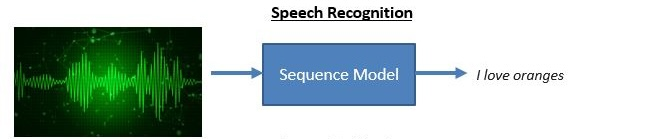
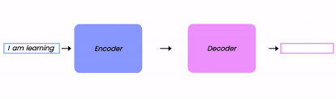
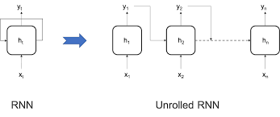
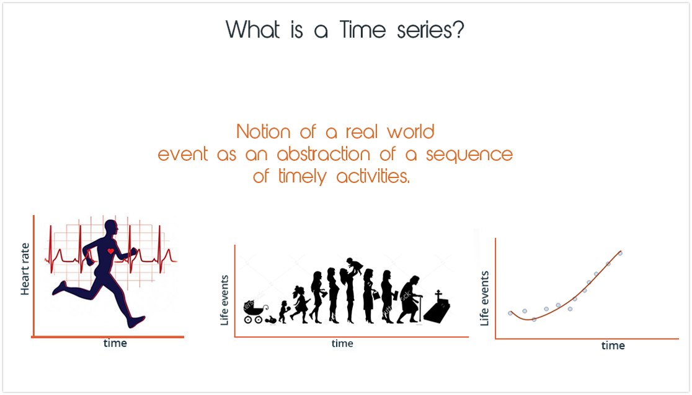
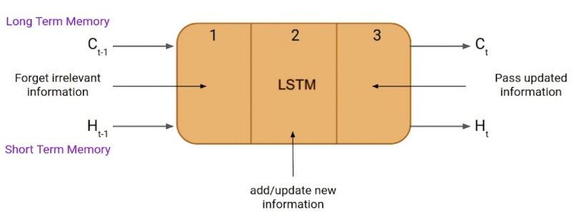

## Sequence Model and Recurrent Neural Network (RNN)

### What is Sequence Model?

In simple terms, a sequence model is a model that can predict the next value in a sequence based on the values that have come before it. Sequence models are used in a wide range of applications, including speech recognition, machine translation, and text generation.

### Some of the applications of the sequence model include:

1. Speech recognition

2. Machine translation

3. Text generation

4. Time series analysis

### Why are Sequence Models and RNNs Important?

Sequence models and RNNs are important because they can be used to solve a wide range of problems that involve sequential data. For example, RNNs are commonly used in natural language processing tasks such as language translation and text generation. Sequence models and RNNs are also used in speech recognition, time series analysis, and many other applications.

### What is Recurrent Neural Network (RNN)?

A Recurrent Neural Network (RNN) is a type of neural network that is designed to handle sequential data. RNNs are ideal for processing sequences of data because they have a memory component that allows them to remember past inputs and use that information to make predictions about future inputs.

Architecture of RNN:

### How does RNN work?

RNNs work by processing sequences of data one element at a time. At each time step, the RNN takes an input and produces an output. The output is then fed back into the RNN as input for the next time step. This allows the RNN to learn patterns in the data and make predictions about future inputs.

### Long Short-Term Memory (LSTM)

One of the key challenges in training RNNs is the problem of vanishing gradients. This occurs when the gradients of the loss function become very small, making it difficult for the model to learn from the data. To address this problem, a type of RNN called Long Short-Term Memory (LSTM) was developed.

LSTMs are designed to address the vanishing gradient problem by introducing a memory cell that can store information over long periods of time. This allows LSTMs to learn long-range dependencies in the data and make more accurate predictions.

Architecture of LSTM:

### Conclusion

Sequence models and RNNs are powerful tools for processing sequential data. They are used in a wide range of applications, including speech recognition, machine translation, and text generation. RNNs are particularly well-suited for processing sequences of data because they have a memory component that allows them to remember past inputs and use that information to make predictions about future inputs. LSTMs are a type of RNN that are designed to address the vanishing gradient problem and learn long-range dependencies in the data. By using sequence models and RNNs, we can build models that can learn from sequential data and make accurate predictions about future inputs.

