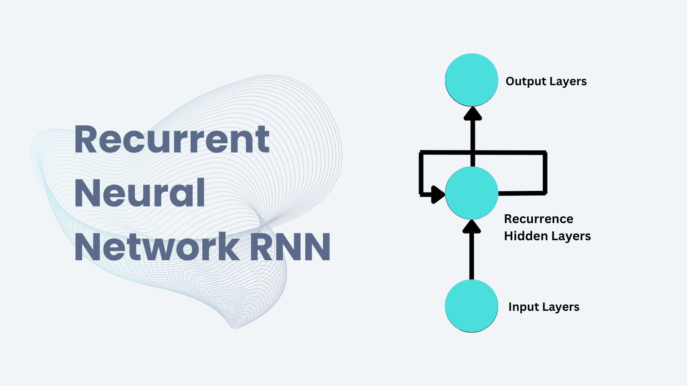

## Sequence Model and Recurrent Neural Network (RNN)

Greetings to you all! Today, I am here to share some of my learning journey towards Sequence Model and Recurrent Neural Network (RNN). I hope you all will join me in exploring the fascinating world of deep learning. Let's dive into the basics of Sequence Model and Recurrent Neural Network (RNN) and how they are transforming the landscape of artificial intelligence. Let's get started.

