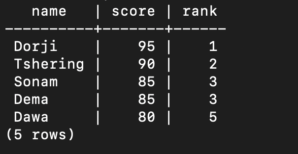
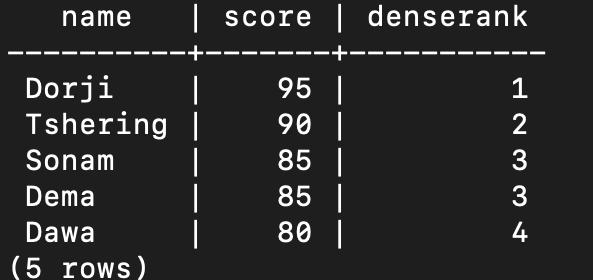
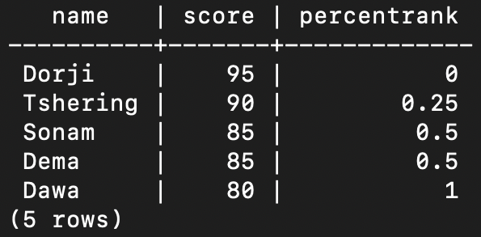
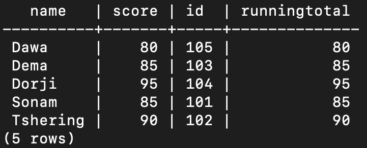
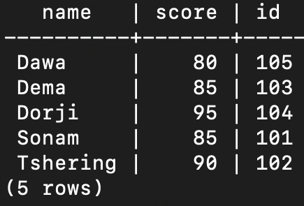
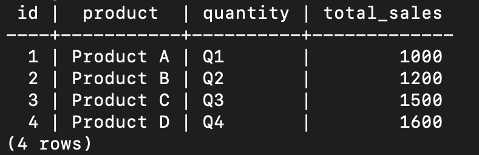
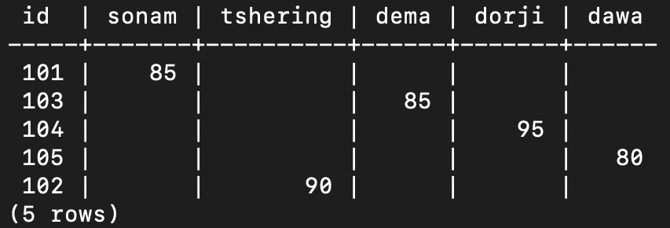
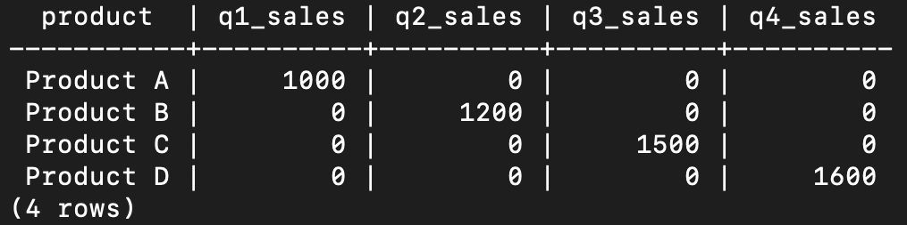
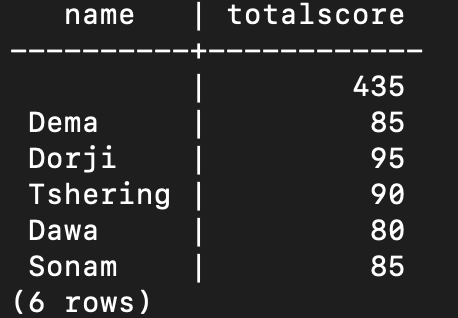
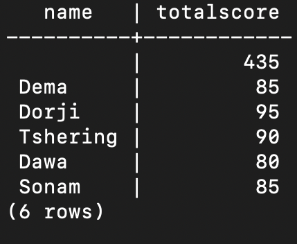

# Agregation functions.

## RANK
To understand RANKS, Imagine that you have a list of items, and you want to rank them based on some criteria, like size or shape or any other features:

### 1.Rank 
The RANK() function helps you do this. It assigns a rank to each item in the list. The first item gets a rank of 1, the second gets a rank of 2, however, if there are items with the same value, they will receive the same rank, and the rank of the next item will skip the ranks that were tied. 
An example of an rank is given below:

So we can clearly see that rank keeps the gap between any two items if there is any same value. for that matter the rank directly jumps from 3 to 5.

### 2.Dense_rank 
DENSE_RANK() is almost same like the RANK() but  DENSE_Rank() doesn't skip any rank numbers. If two items are tied for first, the next item still gets a rank of 2 not 3 which mean it does not skip any rank numbers when two items are tied for the first place. If two items are tied for the first rank, the next item still gets a rank of 2, not 3. This behavior ensures that there are no gaps in the ranking sequence, even when there are ties. 
An example of an dense_rank is given below:

In this context(DENSE_rank), there is no gaps even there is same value of the items

### 3.Percent Rank
The PERCENTRANK is a function that calculates the rank of a value within a data set as a percentage, indicating its relative position among the data set values. 
An example of Percent Rank:

## Windowing
Windowing is like looking at a group of rows in a table and applying a function to them, but unlike regular functions that combine all rows into one result, window functions keep the individual rows and apply the function to a "window" of rows around each row. This allows you to see how each row compares to the others in its group, without losing the detail of each row. 
An example of Windowing:

## Pivoting.
Pivoting is like turning rows into columns to make the data easier to read or analyze. It's like taking a list of items and organizing them into categories, where each category becomes a column, and the items are listed under the correct category.
An example of Pivoting 
#### Before pivoting: 
Example 1: Pivoting on Names and score and ID.

Example 2: Pivoting on ID, Product, quantity and total_sales 

#### Outcome after pivoting: 
Example 1.

Example 2.

## Rollup and Cube. 
### 1.Rollup.
Rollup is like creating a summary table that shows subtotals and a grand total for different levels of data. 
An example of Roll up:

### 2.Cube.
Cube is similar to Rollup but it generates all possible combinations of subtotals and grand totals for the specified columns. 
An example of Cube:

