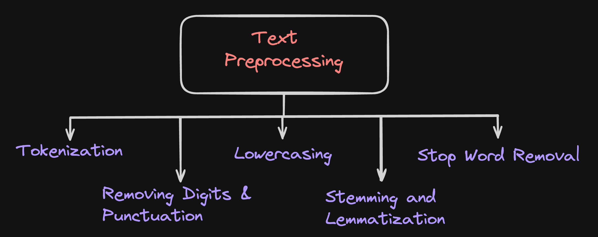
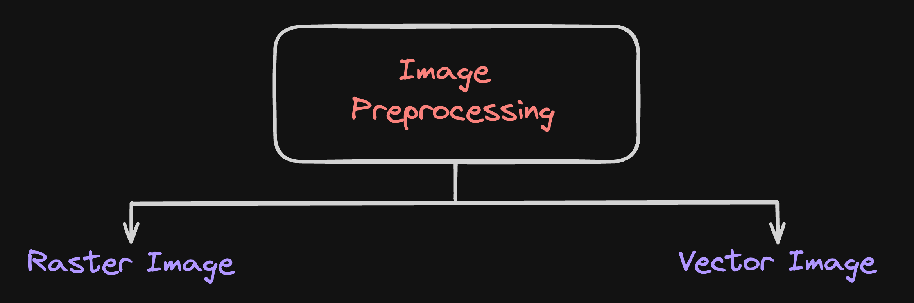

# Topic : Data Preprocessing; Text and Image Processing

Hello everyone! Today, I am  going to talk about how to prepare data before using it in a neural network which is known as “Data Processing”,to understand preprocessing, it is a technique used to make the input data well organized and suitable before it is being fed into the neural network. Lets get started; 

### What is Natural Language Processing (NLP)? 
Natural Language Processing (NLP) is a branch of artificial intelligence that enables computers to understand, interpret, and generate human language, combining computational linguistics, machine learning, and deep learning models to process text and speech data in a way that mimics human communication.

Natural Language Processing (NLP) and data preprocessing are closely linked together because the way we prepare text data can greatly affect how well the NLP models understand and analyze it. 

## Text Preprocessing

Test preprocessing is the step of cleaning and organizing data before using it for testing in data analysis, machine learning, or AI. This is important because real-world data can be messy, incomplete, or have errors. By preprocessing, data is made easier for computers and algorithms to understand and analyze.

### 1. Tokenization.
It is the process of breaking down the text into individual words or tokens. It's the first step in understanding the text and is essential for further processing. 

Imagine that you have a sentence like "I love ice cream." Tokenization is like breaking this sentence into smaller pieces, each piece being a word. So, "I love ice cream" becomes ["I", "love", "ice", "cream"]. This makes it easier for computers to understand and work with the sentence.

### 2. Removing Digits and Punctuation.
Punctuation and special characters (like @, #, $, %, etc.) are often removed because they do not carry much meaningful information for the task at hand.

Sometimes, words are followed by symbols like "!" or "#". These symbols don't really tell us much about the meaning of the words, so we take them out. For example, "I love ice cream!" becomes "I love ice cream".

### 3.Lowercasing.
Converting all the text to lowercase helps in reducing the complexity of the text by ensuring that the same word in different cases is treated as the same token.

When you're talking to someone, you don't usually change the way you say words based on whether they're at the beginning or end of a sentence, right? The same goes for computers. By making everything lowercase, we make sure that "Ice" and "ice" are treated the same way. So, "Ice cream" and "ice cream" are seen as the same thing.

### 4. Stemming and Lemmatization.

**Stemming** is a process that reduces words to their root form by cutting off the ends of words. It's a more aggressive approach and often results in non-existent words. 

For example, the word "running" might be stemmed to "run", and "better" might be stemmed to "bet". This process is fast and can be done using algorithms that don't understand the language's structure.

**Lemmatization**, on the other hand, is a more intersting process. It reduces words to their base or dictionary form, known as the lemma, which is the correct form of a word. Unlike stemming, lemmatization takes into account the morphological analysis of the words. It understands the context and part of speech of a word, and it uses a vocabulary and morphological analysis of words to return the base or dictionary form of a word, which is known as the lemma. 

For example, the word "better" would be lemmatized to "good", and "running" would be lemmatized to "run"

### 5.Stop Word Removel.
Stop words are common words that do not carry much meaningful information (e.g., "the", "is", "and", etc.). Removing them can help in reducing the dimensionality of the data.

There are some words that don't add much meaning to a sentence, like "the", "is", "and", etc. These are called "stop words". By removing them, we can make our data simpler and more focused on the important words. So, "I love the ice cream" becomes "I love ice cream".

## Image Preprocessing

 

### Raster Image.
Raster images are those images which are compiled using pixels, or tiny dots, containing unique color and information that come together to create the image. 

**JPEG (Joint Photographic Experts Group):** A lossy compression format that is commonly used for photographs and images on the web. It's known for its ability to compress images significantly while maintaining a high level of visual quality.

**PNG (Portable Network Graphics):** A lossless compression format that supports transparency and is widely used for web graphics. It's ideal for images that require high quality and transparency.

### Vector Images.
vector images are made up of paths or line art that can be infinitely scalable because they work based on algorithms rather than pixels like in the raster images.

Scalable Vector Graphics (SVG):SVG is mainly used for web design because it's lightweight and can be scaled to any size without losing quality

Portable Document Format (PDF):PDFs can contain both vector and raster images, making them versatile for web, print, and mobile applications. They're great for documents that mix text, images, and graphics.

### Lossy and Lossless.
There are two main ways to reduce file sizes: lossy and lossless compression:

**Lossy compression** gets rid of some data that isn't very noticeable, making the file smaller but not perfect.
 
**Lossless compression** removes only the parts of the file that aren't needed, so you can get the original file back exactly as it was

