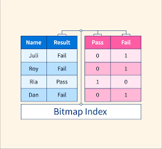
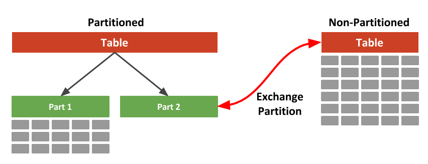

# Query Optimization and Materialized Views

Greetings to you all! Today, I am here to share some of my learning journey towards the Query Optimization and
Materialized Views and how they contribute towards the performance of the database. Let's dive into it; 👍

# Advanced Query Optimization

Query optimization is a crucial process in database management that aims to improve the performance of queries by selecting the most efficient execution plan. By analyzing the query structure, data distribution, and available indexes, the query optimizer generates an optimal plan to retrieve, filter, and join data from the database tables. Advanced query optimization techniques leverage statistics, cost models, and heuristics to estimate the query execution time and select the best plan based on performance metrics like response time, resource consumption, and throughput.

**Two main objectives of Query Optimization are:**

- Determine the optimal plan to access the database.
- Reduce the time required to execute the query.

**Components of Optimizer
There are three components of the optimizers:**
- Transformer
- Estimator
- Plan Generator


**Query Optimization Techniques:**

1. **Cost-Based Optimization:** Cost-based optimization is a query optimization technique that estimates the cost of executing a query plan based on factors like data distribution, index usage, and join operations. By assigning costs to different operations and selecting the plan with the lowest total cost, the optimizer can generate efficient query plans that minimize resource consumption and execution time.


2. **Rule-Based Optimization:** Rule-based optimization is a query optimization technique that uses a set of predefined rules to transform and optimize query plans. These rules define transformations like join reordering, predicate pushdown, and index selection to improve query performance. Rule-based optimizers apply these rules iteratively to generate optimized query plans based on the query structure and available indexes.

**IN Memory Storage**

In-memory storage is a storage method where data is stored in the main memory (RAM) of a computer system instead of traditional disk-based storage. By keeping data in memory, applications can access and process information faster, leading to improved performance and reduced latency. In-memory storage is commonly used in databases, caching systems, and analytics platforms to accelerate data retrieval, processing, and analysis.


**Now lets move with the Bitmap Index Usage**

Bitmap indexing is a data indexing technique used in database management systems (DBMS) to enhance the performance of read-only queries involving large datasets. It involves creating a bitmap index, a data structure that represents the presence or absence of data values in a table or column. Each distinct value in a column is assigned a bit vector (bitmap) that indicates the presence or absence of that value in each row of the table. This technique is particularly effective for columns with low cardinality, meaning they have a modest number of distinct values, either absolutely or relative to the number of records that contain the data.


**Table Partitioning**

Table partitioning is a database design technique that divides large database tables into smaller, more manageable parts called partitions. Each partition contains a subset of the table's data and can be stored and managed independently. Table partitioning improves query performance, data management, and availability by distributing data across multiple storage devices, optimizing data access, and enabling parallel processing. Common partitioning strategies include range partitioning, list partitioning, hash partitioning, and composite partitioning, each suited for different data distribution patterns and access patterns.



## Materialized Views

Materialized views are precomputed views or snapshots of data stored in a database that capture the results of a query or aggregation. Unlike regular views, materialized views store the computed data physically in the database, allowing for faster query processing and reduced computation time. Materialized views are updated periodically to reflect changes in the underlying data, ensuring that the view remains consistent and up-to-date. By caching query results and aggregations, materialized views improve query performance, reduce response time, and enhance the overall efficiency of the database system.

How do we create views in SQL?

```
CREATE MATERIALIZED VIEW view_name AS
SELECT column1, column2, ...
FROM table_name
WHERE condition;
```

**Advantages of Materialized Views:**

- Improved query performance: Materialized views store precomputed results, reducing the need for expensive computations during query execution.

- Reduced response time: By caching query results, materialized views accelerate data retrieval and processing, leading to faster response times.

- Enhanced efficiency: Materialized views optimize query performance, reduce resource consumption, and improve the overall efficiency of the database system.

**Disadvantages of Materialized Views:**

- Storage overhead: Materialized views consume storage space to store precomputed data, increasing the database's storage requirements.

- Maintenance overhead: Materialized views need to be refreshed periodically to reflect changes in the underlying data, adding maintenance overhead to the database system.

- Data consistency: Ensuring the consistency of materialized views with the underlying data can be challenging, especially in dynamic or rapidly changing environments.

In conclusion, query optimization and materialized views are essential techniques in database management that improve query performance, reduce response time, and enhance the efficiency of the database system. By leveraging advanced optimization techniques, in-memory storage, bitmap indexing, table partitioning, and materialized views, database administrators can optimize data access, processing, and retrieval, leading to better performance and scalability. Let's continue to explore these techniques and unlock the full potential of database systems in the dynamic world of data management. 🚀


