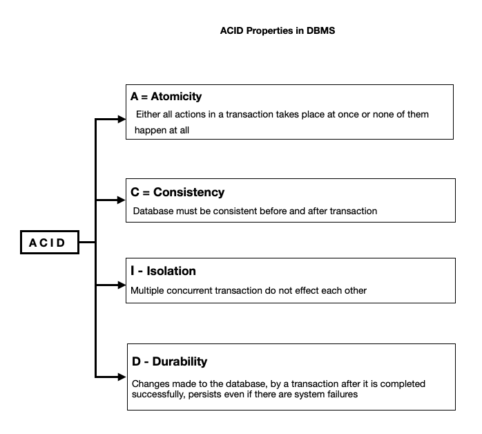

---
Title: DBS101 Flipped Class 10
categories: [DBS101, Flipped_Class10]
tags: [DBS101]
--- 

## Transaction 

Greetings to you all! Today, I am here to share some of my learning journey towards the Transaction and how it is managed in the database. Let's dive into it; 👍

Transaction is a fundamental concept in database management that ensures the integrity, consistency, and durability of data operations. In this seassion we will disucss how the transactions keeps the data consistent and how it is managed in the database and through their ACID properties. We will also explore about serializability, which is a key concept in transaction management that ensures that transactions are executed in a consistent and isolated manner. 

## Understanding Transactions in DBMS

In a database management system, a transaction is a single unit of logic or work, sometimes made up of multiple operations. Any logical calculation done in a consistent mode in a database is known as a transaction.

### Some of the Steps of Transaction are:
1. **Begin Transaction:** The first step in a transaction is to declare the start of the transaction. This step is known as the begin transaction step.

2. **Execute Transaction:** The second step in a transaction is to execute the transaction. This step is known as the execute transaction step.

3. **Commit Transaction:** The third step in a transaction is to commit the transaction. This step is known as the commit transaction step.

### Let's understand Transaction with an example with Banking system with the Steps that is listed above:

1. **Begin Transaction:** The first step in a transaction is to declare the start of the transaction. This step is known as the begin transaction step. In the banking system, the transaction begins when the user logs in to the system to perform a transaction.

2. **Execute Transaction:** The second step in a transaction is to execute the transaction. This step is known as the execute transaction step. In the banking system, the user performs the transaction, such as transferring money from one account to another.

3. **Commit Transaction:** The third step in a transaction is to commit the transaction. This step is known as the commit transaction step. In the banking system, the transaction is committed when the user confirms the transaction and the system updates the account balances.


## ACID Properties of Transactions

In database management, transactions are designed to ensure the integrity, consistency, and durability of data operations. The ACID properties are a set of characteristics that define the behavior of transactions in a database system. The ACID properties are as follows:




### **Atomicity:** 

Atomicity is the property of a transaction that ensures that all operations within the transaction are completed successfully or not at all. If any operation within the transaction fails, the entire transaction is rolled back, and the database is restored to its original state. This property ensures that the database remains in a consistent state and prevents partial updates or data corruption.

### **Consistency:**

Consistency is the property of a transaction that ensures that the database remains in a valid state before and after the transaction. This property enforces data integrity constraints, such as primary key constraints, foreign key constraints, and domain constraints, to maintain the correctness and validity of the data. Consistency guarantees that the database transitions from one valid state to another valid state without violating any constraints.

### **Isolation:**

Isolation is the property of a transaction that ensures that the changes made by one transaction are isolated from the changes made by other transactions. This property prevents interference between concurrent transactions and maintains data integrity and consistency. Isolation levels define the degree of isolation between transactions, ranging from read uncommitted to serializable, based on the level of visibility and concurrency control.

### **Durability:**

Durability is the property of a transaction that ensures that the changes made by a committed transaction are permanent and persist even in the event of system failures. This property guarantees that once a transaction is committed, its changes are stored in the database and remain intact, even if the system crashes or restarts. Durability is typically achieved through logging and recovery mechanisms that record and replay committed transactions to maintain data consistency and availability.

## Transaction States

In a database management system, a transaction can be in one of the following states:


### **Serializability:**

Serializability is a key concept in transaction management that ensures that transactions are executed in a consistent and isolated manner. It guarantees that the execution of concurrent transactions produces the same results as if they were executed serially, one after the other. Serializability is achieved through concurrency control mechanisms like locking, timestamp ordering, and optimistic concurrency control to prevent conflicts and maintain data consistency.

### Types of Schedule in DBMS

In database management, a schedule is a sequence of operations or transactions that are executed concurrently by multiple users or processes. There are two types of schedules in DBMS:

1. **Serial Schedule:** A serial schedule is a schedule in which transactions are executed one after the other, without any overlap or concurrency. Each transaction is executed in its entirety before the next transaction begins, ensuring that the database remains in a consistent state.

     Example: Consider the following schedule involving two transactions T1 and T2.

     | T1 | T2 |
     |----|----|
     | R1 |    |
     |    | R2 |
     | W1 |    |
     |    | W2 |

     In this serial schedule, transaction T1 reads data item 1 (R1), writes to data item 1 (W1), and then transaction T2 reads data item 2 (R2) and writes to data item 2 (W2). The transactions are executed sequentially, with no overlap or concurrency.

2. **Concurrent Schedule:** A concurrent schedule is a schedule in which transactions are executed concurrently, with overlapping operations and interleaved execution. Concurrent schedules improve system performance and throughput by allowing multiple transactions to run simultaneously, but they also introduce challenges like concurrency control and data consistency.
     
      Example: Consider the following concurrent schedule involving two transactions T1 and T2.
     
     | T1 | T2 |
     |----|----|
     | R1 |    |
     |    | R2 |
     | W1 |    |
     |    | W2 |
     
      In this concurrent schedule, transaction T1 reads data item 1 (R1), while transaction T2 reads data item 2 (R2). Then, transaction T1 writes to data item 1 (W1), followed by transaction T2 writing to data item 2 (W2). The transactions are executed concurrently, with overlapping operations and interleaved execution.

     #### Example

     Here is an example of a serial schedule in SQL

     ```
     BEGIN TRANSACTION;
     SELECT * FROM employees WHERE department = 'HR';
     UPDATE employees SET salary = salary + 1000 WHERE department = 'HR';
     COMMIT;
     ```
     In this serial schedule, the transaction begins, reads data from the employees table where the department is 'HR', updates the salary of employees in the HR department, and then commits the transaction. The operations are executed sequentially, one after the other, without any overlap or concurrency.

     Here is an example of a concurrent schedule in SQL

     ```  
     BEGIN TRANSACTION;
     SELECT * FROM employees WHERE department = 'HR';
     BEGIN TRANSACTION;
     SELECT * FROM employees WHERE department = 'Finance';
     UPDATE employees SET salary = salary + 1000 WHERE department = 'HR';
     UPDATE employees SET salary = salary + 500 WHERE department = 'Finance';
     COMMIT;
     COMMIT;
     ```

     In this concurrent schedule, two transactions are executed concurrently. The first transaction reads data from the employees table where the department is 'HR', while the second transaction reads data from the employees table where the department is 'Finance'. Then, the first transaction updates the salary of employees in the HR department, and the second transaction updates the salary of employees in the Finance department. Finally, both transactions are committed, allowing multiple transactions to run simultaneously with overlapping operations.


## Conclusion

In conclusion, transactions are a fundamental concept in database management that ensures the integrity, consistency, and durability of data operations. By adhering to the ACID properties and serializability, transactions maintain data integrity, prevent data corruption, and ensure that the database remains in a consistent state. Understanding transaction states, serializability, and different types of schedules in DBMS is essential for designing efficient and reliable database systems that can handle concurrent transactions and maintain data consistency. I hope this session has provided you with a better understanding of transactions in DBMS and their importance in database management. Thank you for your attention! 

### Flipped Class activites: Understanding on Transaction and ACID properties.

In the Flipped Class session, we dived into transactions and their ACID properties. The task that we have performed:

1. Database Initialization:

     - Created a new database named test_transaction.
     - Created an accounts table with columns for account_name and balance.
     - Inserted initial records/ values for accounts ‘A’ with a balance of 1000 and ‘B’ with a balance of 2000.

     

2. Transaction for Balance Transfer:

     - Transferred 500 from account ‘A’ to account ‘B’.
     - Displaying the **accounts** table before and after the transaction

     

3. Updating Account Balance:
     - Started a transaction and updated the balance of account ‘A’, subtracting 100 form it.

     
     

4. Inserting and Committing Data:

     - Then began a transaction, inserted a new record for account ‘B’ with a balance of 500, and committed so that the transaction is completed.

     

5. Handling Transaction Errors:

     - This step attempted to update the balance of a non-existent account ‘D’, then rolled back the transaction.

     

     - This step tried to insert a new record for account ‘E’ with a balance of 700, but rolled back the transaction due to an error.

     

6. Successful Transaction:

     - In this step it initiated a transaction, inserted a new record for account ‘F’ with a balance of 1000, and committed the transaction.

     

     ## Summary

     In conclusion, the Flipped Class activities provided a hands-on experience with transactions and their ACID properties in a database management system. By performing tasks like balance transfers, updating account balances, inserting data, and handling transaction errors, we gained practical insights into transaction management and the importance of maintaining data integrity and consistency. Understanding how transactions work, their atomicity, consistency, isolation, durability, and serializability is essential for designing reliable and efficient database systems that can handle concurrent transactions and ensure data integrity. I hope this session has enhanced your understanding of transactions in DBMS and their role in database management. Thank you for your participation! 

