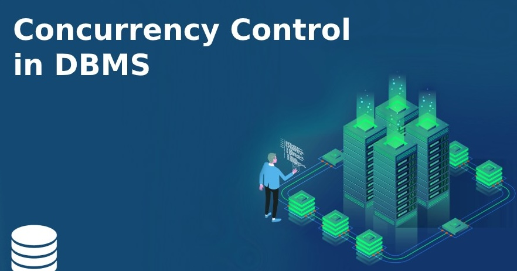
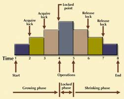

---
Title: DBS101 Flipped Class 11
categories: [DBS101, Flipped_Class10]
tags: [DBS101]
--- 

## Concurrency Control

Greetings to you all! In this flipped class, we will be discussing about Concurrency Control.

### What is Concurrency Control?

Concurrency control is a database management systems (DBMS) concept that is used to address occurrences of simultaneous transactions that can lead to inconsistency in the database. Concurrency control is a method used to ensure that transactions are executed in a safe and consistent manner.

### Why is Concurrency Control Important?

Concurrency control is important because it ensures that transactions are executed in a safe and consistent manner. Without concurrency control, transactions can interfere with each other, leading to inconsistencies in the database. Concurrency control is essential for maintaining the integrity of the database and ensuring that transactions are executed correctly.

### Types of Concurrency Control

There are several types of concurrency control methods that can be used to manage simultaneous transactions in a database. Some of the most common types of concurrency control include:

1. Lock-based concurrency control

2. Timestamp-based concurrency control

3. Two-phase locking (2PL)

## Now let's discuss each of these methods in more detail.
### Lock-based Concurrency Control

Lock-based concurrency control is a method that uses locks to manage simultaneous transactions in a database. When a transaction wants to access a data item, it must first acquire a lock on that data item. The lock prevents other transactions from accessing the data item until the lock is released.

There are two main types of locks that can be used in lock-based concurrency control:

1. Shared locks: Allow multiple transactions to read a data item but prevent any transaction from writing to the data item.

2. Exclusive locks: Prevent other transactions from reading or writing to a data item.

### Timestamp-based Concurrency Control

Timestamp-based concurrency control is a method that uses timestamps to manage simultaneous transactions in a database. Each transaction is assigned a unique timestamp when it is created. When a transaction wants to access a data item, the DBMS compares the transaction's timestamp with the timestamps of other transactions that are currently accessing the data item.

If the transaction's timestamp is older than the timestamps of the other transactions, the transaction is allowed to access the data item. If the transaction's timestamp is newer than the timestamps of the other transactions, the transaction is aborted.

## Two-phase Locking (2PL)

Two-phase locking (2PL) is a method that uses two phases to manage simultaneous transactions in a database. In the first phase, transactions acquire locks on the data items that they want to access. In the second phase, transactions release the locks on the data items that they have accessed.

Two-phase locking ensures that transactions do not interfere with each other by preventing transactions from accessing data items that are already being accessed by other transactions.

There are two main types of locks that can be used in two-phase locking:

1. Growing phase: Transactions acquire locks on data items that they want to access.

2. Shrinking phase: Transactions release the locks on data items that they have accessed.

Illustration of Two-Phase Locking (2PL)

Let’s see a transaction implementing 2-PL.

|    | T1   | T2   |
|----|------|------|
| 1  | lock(X) |      |
| 2  | read(X) |      |
| 3  | X = X + 100 |      |
| 4  | write(X) |      | 
| 5  |      | lock(Y) |
| 6  |      | read(Y) |
| 7  |      | Y = Y + 100 |
| 8  |      | write(Y) |
| 9  | unlock(X) |      |
| 10 |      | unlock(Y) |

In this example, T1 acquires a lock on data item X in line 1 and releases the lock in line 9. T2 acquires a lock on data item Y in line 5 and releases the lock in line 10. This ensures that T1 and T2 do not interfere with each other.

**Transaction T1**
- The growing phase of T1 is from line 1 to line 4.
- The shrinking phase of T1 is from line 9 to line 9.
- Locking phase of T1 is from line 1 to line 9.

**Transaction T2**
- The growing phase of T2 is from line 5 to line 8.
- The shrinking phase of T2 is from line 10 to line 10.
- Locking phase of T2 is from line 5 to line 10.

There are the some most common types of Two-phase locking protocol:

1. Strict Two-Phase Locking (Strict 2PL)
     - In strict 2PL, a transaction must acquire all the locks it needs before it can access any data item.
     - Once a transaction releases a lock, it cannot acquire any new locks.
     - Strict 2PL ensures that transactions do not interfere with each other by preventing transactions from acquiring new locks after they have released locks.

2. Rigorous Two-Phase Locking (Rigorous 2PL)
     - In rigorous 2PL, a transaction must acquire all the locks it needs before it can access any data item.
     - Once a transaction releases a lock, it cannot acquire any new locks.
     - Rigorous 2PL ensures that transactions do not interfere with each other by preventing transactions from acquiring new locks after they have released locks.

3. Conservative Two-Phase Locking (Conservative 2PL)
     - In conservative 2PL, a transaction must acquire all the locks it needs before it can access any data item.
     - Once a transaction releases a lock, it cannot acquire any new locks.
     - Conservative 2PL ensures that transactions do not interfere with each other by preventing transactions from acquiring new locks after they have released locks.

### Now lets learn what is Timestamp Ordering Protocol?

Timestamp ordering protocol is a method that uses timestamps to manage simultaneous transactions in a database. Each transaction is assigned a unique timestamp when it is created. When a transaction wants to access a data item, the DBMS compares the transaction's timestamp with the timestamps of other transactions that are currently accessing the data item.

If the transaction's timestamp is older than the timestamps of the other transactions, the transaction is allowed to access the data item. If the transaction's timestamp is newer than the timestamps of the other transactions, the transaction is aborted.

Timestamp ordering protocol ensures that transactions do not interfere with each other by preventing transactions from accessing data items that are already being accessed by other transactions.

For example, consider the following transactions:

- T1: read(X), X = X + 100, write(X)
- T2: read(X), X = X - 50, write(X)

If T1 has a timestamp of 1 and T2 has a timestamp of 2, the DBMS will allow T1 to access data item X because its timestamp is older than T2's timestamp. If T2 has a timestamp of 1 and T1 has a timestamp of 2, the DBMS will allow T2 to access data item X because its timestamp is older than T1's timestamp.

### Some of the advantages of Timestamp Ordering Protocol are:

1. It is simple and easy to implement.
2. It ensures that transactions are executed in a safe and consistent manner.
3. It prevents transactions from interfering with each other.

### Some of the disadvantages of Timestamp Ordering Protocol are:

1. It can lead to deadlocks if transactions are not properly managed.
2. It can be inefficient if there are a large number of transactions that need to be managed.
 
### Now lets go through on Locks and Latches

Locks and latches are mechanisms used to manage simultaneous transactions in a database. Locks are used to control access to data items, while latches are used to control access to system resources.

**Locks** are used to prevent other transactions from accessing a data item while a transaction is accessing it. There are two main types of locks that can be used in a database:

1. Shared locks: Allow multiple transactions to read a data item but prevent any transaction from writing to the data item.

2. Exclusive locks: Prevent other transactions from reading or writing to a data item.

**Latches** are used to prevent other transactions from accessing system resources while a transaction is accessing them. Latches are used to control access to system resources such as memory, disk space, and CPU time. There are two main types of latches that can be used in a database:

1. Shared latches: Allow multiple transactions to access a system resource but prevent any transaction from modifying the resource.

2. Exclusive latches: Prevent other transactions from accessing or modifying a system resource.

### Difference between Locks and Latches

| Locks | Latches |
|-------|---------|
| Used to control access to data items | Used to control access to system resources |     
| Prevent other transactions from accessing a data item | Prevent other transactions from accessing system resources |
| Two main types: shared locks and exclusive locks | Two main types: shared latches and exclusive latches |
| Used to manage simultaneous transactions in a database | Used to manage system resources in a database |

### Conclusion

In this flipped class, we discussed about Concurrency Control. We learned about the importance of concurrency control, the types of concurrency control methods, and the advantages and disadvantages of each method. We also discussed about locks and latches, and the difference between locks and latches. I hope you found this flipped class informative and helpful.

Thank you for your attention!

