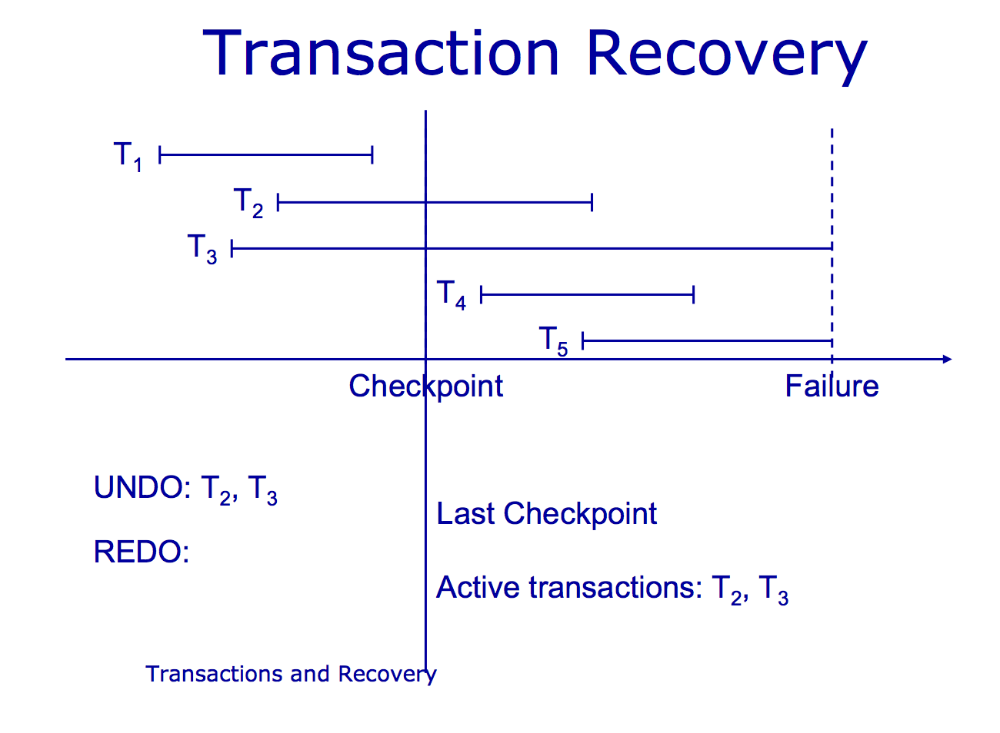

## Recovery System 

Database recovery is the process of restoring the database to a correct (consistent) state in the event of a failure. In other words, it is the process of restoring the database to the most recent consistent state that existed shortly before the time of system failure.

### Recovery Techniques

1. **Deferred Update Technique**: In this technique, the updates are not applied to the database until the transaction reaches its commit point. The transaction is first executed and then the updates are applied to the database. If the transaction fails, the updates are not applied to the database. This technique is also known as the NO-UNDO/REDO technique.

2. **Immediate Update Technique**: In this technique, the updates are applied to the database as soon as the transaction reaches its commit point. The transaction is first executed and then the updates are applied to the database. If the transaction fails, the updates are applied to the database. This technique is also known as the UNDO/REDO technique.

### Recovery Operations

1. **Undo Operation**: The undo operation is used to rollback the changes made by a transaction. It is used to restore the database to the state that existed before the transaction started.

2. **Redo Operation**: The redo operation is used to reapply the changes made by a transaction. It is used to restore the database to the state that existed after the transaction started.

3. **Checkpoint Operation**: The checkpoint operation is used to write the database state to the disk. It is used to reduce the recovery time in case of a system failure.

The given figure illustrates the recovery operations in a database system.

## Recovery Algorithms

Recovery algorithms are techniques to ensure database consistency, transaction atomicity, and durability despite failures.

Recovery algorithms have two parts: → Actions during normal txn processing to ensure that the DBMS can recover from a failure. In other words:

1. Actions taken during normal transaction processing to ensure enough information exists to recover from failures.

2. Actions taken after a failure to recover the database contents to a state that ensures atomicity, consistency and durability.
 
### 1. Ensuring Database Consistency, Transaction Atomicity, and Durability Despite Failures:

1. **Ensuring Database Consistency**: The database consistency is ensured by maintaining the ACID properties of transactions. The ACID properties are Atomicity, Consistency, Isolation, and Durability.

2. **Ensuring Transaction Atomicity**: The transaction atomicity is ensured by using the commit and rollback operations. The commit operation is used to make the changes permanent, while the rollback operation is used to undo the changes.

3. **Ensuring Transaction Durability**: The transaction durability is ensured by using the write-ahead logging technique. In this technique, the changes made by a transaction are first written to the log file before they are applied to the database.

### 2. Actions Taken After a Failure to Recover the Database Contents:

1. **Recovery Algorithms**: The recovery algorithms are used to recover the database contents to a state that ensures atomicity, consistency, and durability. There are two types of recovery algorithms: deferred update and immediate update.

2. **Deferred Update Recovery Algorithm**: In this algorithm, the updates are not applied to the database until the transaction reaches its commit point. The transaction is first executed and then the updates are applied to the database. If the transaction fails, the updates are not applied to the database.

3. **Immediate Update Recovery Algorithm**: In this algorithm, the updates are applied to the database as soon as the transaction reaches its commit point. The transaction is first executed and then the updates are applied to the database. If the transaction fails, the updates are applied to the database.

### 3. Actions After a Failure:

1. **Recovery Techniques**: The recovery techniques are used to restore the database to a correct state in the event of a failure. There are two types of recovery techniques: deferred update and immediate update.

2. **Deferred Update Recovery Technique**: In this technique, the updates are not applied to the database until the transaction reaches its commit point. The transaction is first executed and then the updates are applied to the database. If the transaction fails, the updates are not applied to the database.

3. **Immediate Update Recovery Technique**: In this technique, the updates are applied to the database as soon as the transaction reaches its commit point. The transaction is first executed and then the updates are applied to the database. If the transaction fails, the updates are applied to the database.

### 4. Actions During Normal Transaction Processing:

To ensure that the recovery from failures, databases take precautions during normal transaction processing.

**Logging changes to the database:** The database system logs changes to the database to ensure that the database can be recovered to a consistent state in the event of a failure.

**Maintaining checkpoints:** The database system maintains checkpoints to reduce the recovery time in case of a system failure.

### 5. Actions After a Failure:

After a failure, the database system uses the recovery algorithms to recover the database to a consistent state.

**Recovering from a failure:** The database system recovers the database to a consistent state by using the recovery algorithms.

**Restoring the database to a consistent state:** The database system restores the database to a consistent state by using the recovery algorithms.

When a failure occurs, the database needs to spring into action to get things back to normal.

Analysis of Logs: The database system analyzes the logs to determine the changes that need to be undone or redone.

Redo and Undo Operations: The database system performs redo and undo operations to restore the database to a consistent state.

### ARIES

The ARIES (Algorithm for Recovery and Isolation Exploiting Semantics) is a recovery algorithm that is used to recover the database to a consistent state in the event of a failure. It is a log-based recovery algorithm that uses the write-ahead logging technique to ensure that the database can be recovered to a consistent state in the event of a failure.

The fundamental concept behind ARIES is its use of a write-ahead log. The write-ahead log is a log file that records all changes made to the database before they are applied to the database. This ensures that the database can be recovered to a consistent state in the event of a failure.

**write-ahead logging** is a technique used in database systems to ensure that the database can be recovered to a consistent state in the event of a failure. In this technique, the changes made by a transaction are first written to the log file before they are applied to the database. This ensures that the database can be recovered to a consistent state in the event of a failure.

### Checkpoint

A checkpoint is a point in time at which the database state is written to the disk. It is used to reduce the recovery time in case of a system failure. The checkpoint operation is used to write the database state to the disk. It is used to reduce the recovery time in case of a system failure.

#### Fuzzy checkpointing

Fuzzy checkpointing is a technique used in database systems to reduce the recovery time in case of a system failure. In this technique, the database state is written to the disk in a fuzzy state. This means that the database state is not written to the disk in a consistent state, but in a state that is close to the consistent state. This reduces the recovery time in case of a system failure.

ARIIES (Algorithm for Recovery and Isolation Exploiting Semantics)
ARIES (Algorithm for Recovery and Isolation Exploiting Semantics) is a robust and efficient recovery algorithm used in database management systems. Its primary goal is to ensure that databases can recover to a consistent state after a crash or failure, preserving the atomicity and durability properties of transactions.

### Key Concepts
Write-Ahead Logging (WAL)
ARIES is based on the Write-Ahead Log protocol. WAL ensures that all changes (updates, inserts, deletes) to the database are logged before they are applied to the database itself. This allows the system to recover from crashes by replaying or undoing these logged changes.
Logs

Logs are essential in ARIES. They keep a record of all database operations. When a crash occurs, these logs are used to restore the database to a consistent state.
ARIES Algorithm Phases
Analysis Phase

The analysis phase scans the log from the last checkpoint to the end.

It identifies all active transactions at the time of the crash and reconstructs the Dirty Page Table (DPT), which tracks pages that were modified but not yet written to disk.

This phase helps in determining which transactions were incomplete and need to be undone.

Redo Phase

Once the analysis phase is complete, the redo phase starts.

In this phase, the log is read forward from the last checkpoint, and all the operations recorded in the log are reapplied to the database.

This ensures that all changes made by committed transactions are reflected in the database. Only changes that are not already present in the database (as indicated by the DPT) are redone.

Undo Phase

After the redo phase, the undo phase begins.

The log is scanned backward, and the operations of transactions that were active at the time of the crash are undone in reverse order.

This ensures that any changes made by uncommitted transactions are rolled back, leaving the database in a consistent state.

Compensation Log Records (CLRs) are written during this phase to log the undo operations, ensuring that they can be redone if another crash occurs during the undo process.

Advantages of ARIES
Simplicity and Flexibility: ARIES is straightforward and can be adapted to various database and storage systems.

Concurrency Control: Supports concurrent transaction processing, making it suitable for high-performance environments.

Independent Recovery: Allows for the independent recovery of every page in the database, speeding up the recovery process and improving system availability.

### Fuzzy Checkpoint
A fuzzy checkpoint is a mechanism in a Database Management System (DBMS) that allows ongoing transactions to continue while dirty pages (modified pages in memory that have not yet been written to disk) are being flushed to disk. This approach aims to improve system performance and transaction throughput by reducing the time and resource overhead associated with checkpoint operations.

#### Key Characteristics:

1. **Non-blocking Checkpointing:**
Fuzzy checkpoints are non-blocking, meaning that they do not halt ongoing transactions or prevent new transactions from starting. This allows the system to maintain high throughput and responsiveness during the checkpoint process.

2. **Checkpoint Boundaries:** 
Fuzzy checkpoints do not have strict boundaries or fixed points in time when the checkpoint operation occurs. Instead, they continuously flush dirty pages to disk as part of the normal transaction processing flow.

3. **Log Sequence Numbers (LSN);**
Fuzzy checkpoints use Log Sequence Numbers (LSNs) to track the progress of the checkpoint operation. LSNs are unique identifiers assigned to each log record, allowing the system to determine which pages have been flushed to disk and which ones are still in memory.

### Database Logging

Database logging is a technique used in database systems to ensure that the database can be recovered to a consistent state in the event of a failure. In this technique, the changes made by a transaction are first written to the log file before they are applied to the database. This ensures that the database can be recovered to a consistent state in the event of a failure.

#### Types of Database Logging:
Circular logging. Circular logging is the default behavior when a new database is created. ...
Archive logging. ...
Advanced Log Space Management. ...
Log control files.

1. **Circular logging:** Circular logging is the default behavior when a new database is created. It is a simple and efficient logging method that overwrites old log entries once the log file reaches a certain size or time limit. This helps prevent the log file from growing too large and consuming excessive disk space.

2. **Archive logging:** Archive logging is a more advanced logging method that preserves log entries even after they have been applied to the database. This allows for point-in-time recovery and auditing of database changes. Archive logging is commonly used in production environments where data integrity and recoverability are critical.

### Conclusion

Database recovery is the process of restoring the database to a correct state in the event of a failure. Recovery techniques, operations, and algorithms are used to ensure database consistency, transaction atomicity, and durability despite failures. ARIES is a robust recovery algorithm that uses write-ahead logging to recover the database to a consistent state in the event of a failure. Fuzzy checkpointing is a mechanism that allows ongoing transactions to continue while dirty pages are flushed to disk, improving system performance and transaction throughput. Database logging is a technique used to ensure that the database can be recovered to a consistent state in the event of a failure.

