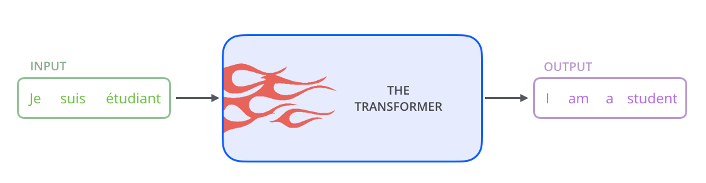
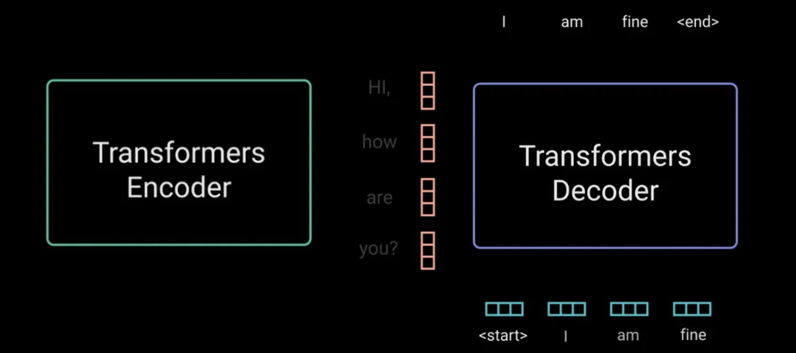
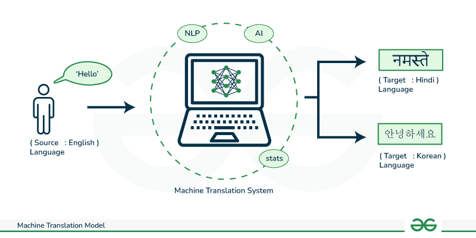
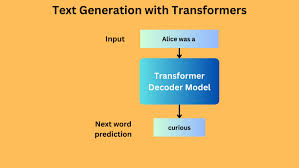

# Transformers, Introduction to Diffusion Models and Transfer Learning.

## Transformers

Transformer have been a breakthrough in the field of Natural Language Processing (NLP) and have revolutionized the way we build deep learning models for text data. The transformer architecture was introduced in the paper "Attention is All You Need" by Vaswani et al. in 2017. 

The transformer model is based on the self-attention mechanism, which allows the model to focus on different parts of the input sequence when processing it. This attention mechanism enables the transformer to capture long-range dependencies in the data and learn complex patterns more effectively than traditional recurrent or convolutional neural networks.

## What is a Transformer? 🤔

A transformer is a deep learning model that uses self-attention mechanisms to process sequential data which makes them highly effective for NLP tasks.

## How does a Transformer work? 🤔

It consists of an:
1. Encoder &
2. A Decoder

Each composed of multiple layers of self-attention and feedforward neural networks. The encoder processes the input sequence, while the decoder generates the output sequence. The transformer model is highly parallelizable and can scale to handle large datasets and complex tasks efficiently. It has become the de facto standard for NLP tasks like machine translation, text generation, and sentiment analysis due to its superior performance and scalability.

The Figure below shows the architecture of a transformer model:

This figure demonstrates how the decoder generates the output sequence by attending to the input sequence and the previously generated tokens form the encoder that has benn passed to the decoder. The self-attention mechanism allows the model to focus on different parts of the input sequence at each layer, enabling it to capture complex patterns and dependencies in the data effectively.

## Why are Transformer better than RNN?🤔

Transformers have several advantages over traditional recurrent neural networks (RNNs) and convolutional neural networks (CNNs) for NLP tasks due to their unique architecture and self-attention mechanism. Some of the key advantages of transformers include:

1. **Long-range dependencies**: Transformers can capture long-range dependencies in the data more effectively than RNNs, which makes them better suited for tasks that require modeling complex patterns in sequential data.

2. **Parallel processing**: Transformers are highly parallelizable, which allows them to process data more efficiently and scale to handle large datasets and complex tasks.

3. **Scalability**: Transformers can scale to handle large datasets and complex tasks more effectively than RNNs and CNNs, making them suitable for a wide range of NLP tasks.

## Some of the applications of Transformers are:

1. **Machine Translation**: Transformers have been used to build state-of-the-art machine translation models that can translate text between different languages with high accuracy.

2. **Text Generation**: Transformers can generate text based on a given input sequence, making them useful for tasks like chatbots, text summarization, and content generation.

## Conclusion

Transformers have revolutionized the field of NLP and have become the de facto standard for building deep learning models for text data. Their unique architecture and self-attention mechanism enable them to capture complex patterns and dependencies in the data more effectively than traditional RNNs and CNNs. Transformers have been used to build state-of-the-art models for machine translation, text generation, and other NLP tasks, and their scalability and efficiency make them suitable for a wide range of applications.

