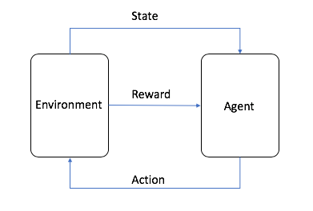
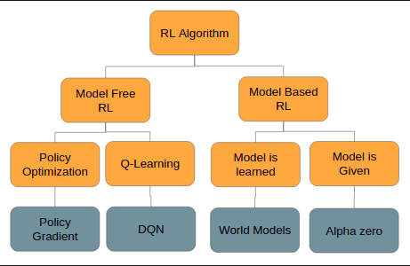

# Reinforcement Learning

## What is reinforcement learning?

Reinforcement learning (RL) is a machine learning (ML) technique that trains software to make decisions to achieve the most optimal results. It mimics the trial-and-error learning process that humans use to achieve their goals. In RL, an agent learns to make decisions by interacting with its environment and receiving feedback in the form of rewards or penalties. By exploring different actions and observing the outcomes, the agent learns to maximize its rewards over time and improve its decision-making process. 

## How does reinforcement learning work?

The learning process of reinforcement learning (RL) algorithms is similar to animal and human reinforcement learning in the field of behavioral psychology. For instance, a child may discover that they receive parental praise when they help a sibling or clean but receive negative reactions when they throw toys or yell. Soon the child learns which combination of activities results in the end reward.

An RL algorithm mimics a similar learning process. It tries different activities to learn the associated negative and positive values to achieve the end reward outcome.

**Key concepts**:

In reinforcement learning, there are a few key concepts to familiarize yourself with:

- **The agent** is the ML algorithm (or the autonomous system)
- **The environment** is the adaptive problem space with attributes such as variables, boundary values, rules, and valid actions
- **The action** is a step that the RL agent takes to navigate the environment
- **The state** is the environment at a given point in time
- **The reward** is the positive, negative, or zero value—in other words, the reward or punishment—for taking an action
- **The cumulative reward** is the sum of all rewards or the end value

## Algorithm basics

Reinforcement learning is based on the Markov decision process, a mathematical modeling of decision-making that uses discrete time steps. At every step, the agent takes a new action that results in a new environment state. Similarly, the current state is attributed to the sequence of previous actions.

Through trial and error in moving through the environment, the agent builds a set of if-then rules or policies. The policies help it decide which action to take next for optimal cumulative reward. The agent must also choose between further environment exploration to learn new state-action rewards or select known high-reward actions from a given state. This is called the exploration-exploitation trade-off.

## The types of reinforcement learning algorithms?

There are various algorithms used in reinforcement learning (RL)—such as
- Q-learning,
- policy gradient methods, 
- Monte Carlo methods, 
- temporal difference learning.

Deep RL is the application of deep neural networks to reinforcement learning. One example of a deep RL algorithm is Trust Region Policy Optimization (TRPO).

All these algorithms can be grouped into two broad categories.

## 1. Model-based RL

Model-based RL is typically used when environments are well-defined and unchanging and where real-world environment testing is difficult.

The agent first builds an internal representation (model) of the environment. It uses this process to build this model:

1. It takes actions within the environment and notes the new state and reward value
2. It associates the action-state transition with the reward value.

Once the model is complete, the agent simulates action sequences based on the probability of optimal cumulative rewards. It then further assigns values to the action sequences themselves. The agent thus develops different strategies within the environment to achieve the desired end goal. 

Example:

Consider a robot learning to navigate a new building to reach a specific room. Initially, the robot explores freely and builds an internal model (or map) of the building. For instance, it might learn that it encounters an elevator after moving forward 10 meters from the main entrance. Once it builds the map, it can build a series of shortest-path sequences between different locations it visits frequently in the building.

## 2. Model-free RL 

Model-free RL is best to use when the environment is large, complex, and not easily describable. It’s also ideal when the environment is unknown and changing, and environment-based testing does not come with significant downsides.

The agent doesn’t build an internal model of the environment and its dynamics. Instead, it uses a trial-and-error approach within the environment. It scores and notes state-action pairs—and sequences of state-action pairs—to develop a policy. 

Example:

Consider a self-driving car that needs to navigate city traffic. Roads, traffic patterns, pedestrian behavior, and countless other factors can make the environment highly dynamic and complex. AI teams train the vehicle in a simulated environment in the initial stages. The vehicle takes actions based on its current state and receives rewards or penalties.

Over time, by driving millions of miles in different virtual scenarios, the vehicle learns which actions are best for each state without explicitly modeling the entire traffic dynamics. When introduced in the real world, the vehicle uses the learned policy but continues to refine it with new data.

Overall this is the work flow of the algorithms

## Conclusion

Reinforcement learning is a powerful machine learning technique that enables software agents to learn optimal decision-making policies by interacting with their environment. By exploring different actions and receiving feedback in the form of rewards or penalties, RL agents can learn to maximize their cumulative rewards over time and improve their decision-making process. With the rise of deep reinforcement learning and advances in AI research, RL has become a key technology in developing intelligent systems that can learn and adapt to complex environments. By understanding the key concepts and algorithms of reinforcement learning, you can unlock the potential of this exciting field and build intelligent agents that can tackle a wide range of tasks and challenges. Let's continue to explore the world of reinforcement learning and discover the amazing possibilities it offers in the field of AI and machine learning. 👍