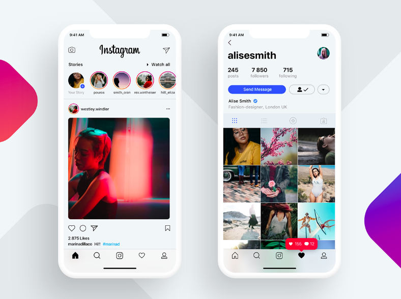
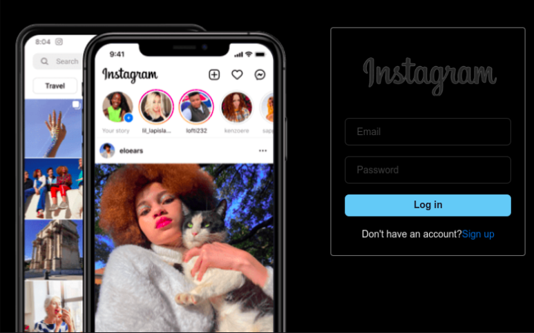
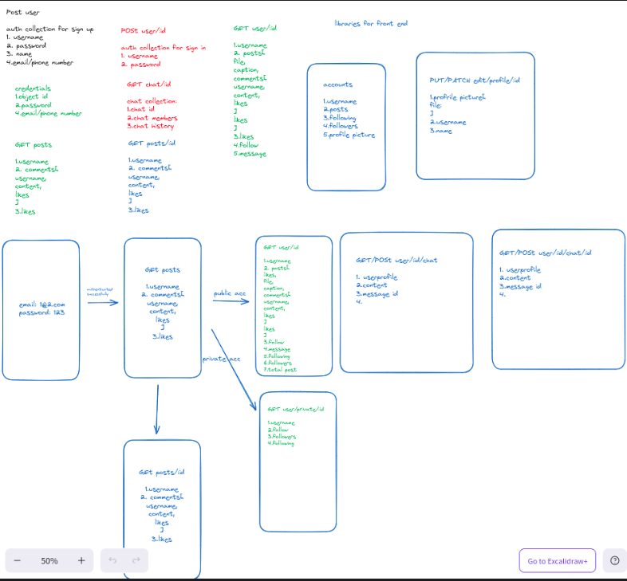

# Topic: Final Project [Instagram clone]

We document the process of cloning Instagram, focusing on both backend and frontend development. This includes setting up a database, developing the backend with Prisma and Hono, and building the frontend with a modern JavaScript framework.

## Table of Contents
1. [Developing the Frontend](#developing-the-frontend)
2. [Setting Up the Backend](#setting-up-the-backend)
3. [Integrating Frontend and Backend](#integrating-frontend-and-backend)
4. [Challenges and Solutions](#challenges-and-solutions)
5. [Conclusion](#conclusion)

## Developing the Frontend

### Designing of UI

In the process of designing our frontend, we structured the basic UI components that are necessary for displaying a simple instagram page.

### Implementing the UI

We implemented the UI components using React, a popular JavaScript library for building user interfaces. We used React components to create reusable UI elements such as buttons, input fields, and cards. Aside from these basic components, we also implemented more complex components such as the feed, profile, and post components. These components were designed to display data fetched from the backend. We used the Axios library to make HTTP requests to the backend API.

The main css library that we used was Chakra UI, which is a component library for React that provides a set of accessible and customizable components. We used Chakra UI to style our components and create a consistent design across the application.

We used chakra ui because it is a simple and easy to use css library that provides a set of accessible and customizable components. 

### Styling the UI

We used Chakra UI to style our components and create a consistent design across the application. Chakra UI provides a set of accessible and customizable components that can be easily styled using props. We used the Box, Flex, and Text components to create layouts and style text. We also used the Button component to create buttons and the Input component to create input fields. Chakra UI also provides a ThemeProvider component that allows us to define a custom theme for our application.

### Implementing User Authentication

For authentication we built a simple signup and login form. We used the useState hook to manage the form state and the useEffect hook to make API requests to the backend. We used the useHistory hook to redirect the user to the feed page after successful login. We also used the useContext hook to manage the user state and provide authentication context to other components.

### Implementing User Profile

We implemented the user profile page using the useParams hook to get the user id from the URL. We used the useEffect hook to fetch user data from the backend and display it on the profile page. We also implemented the follow and unfollow functionality using the useState hook to manage the follow state and the useEffect hook to make API requests to the backend.

### Implementing Feed

We are going to implement the feed page using the useEffect hook to fetch posts from the backend and display them in a list. We used the useState hook to manage the post state and the useEffect hook to make API requests to the backend. We also implemented the like and comment functionality using the useState hook to manage the like and comment state and the useEffect hook to make API requests to the backend.

### Implementing Post

We are going to implement the post page using the useParams hook to get the post id from the URL. We used the useEffect hook to fetch post data from the backend and display it on the post page. We also implemented the like and comment functionality using the useState hook to manage the like and comment state and the useEffect hook to make API requests to the backend.

### Implementing Search

We are going to implement the search page using the useState hook to manage the search query and the useEffect hook to fetch search results from the backend. We used the useState hook to manage the search results state and the useEffect hook to make API requests to the backend.

## Setting Up the Backend

### Setting Up the database

**Schema design**

We used Prisma to set up the database for our Instagram clone. Prisma is an open-source database toolkit that makes it easy to work with databases in a type-safe and efficient way. We used Prisma to also define the data model for our application and generate the database schema. We also used Prisma Migrate to manage database migrations and Prisma Client to interact with the database.

### Choosing a database schema

We chose sqlite database schema because it is easy to use and provides a lot of features that are necessary for our application. We defined the data model for our application using Prisma and generated the database schema. We used Prisma Migrate to manage database migrations and Prisma Client to interact with the database.

## Integrating Frontend and Backend

### Making HTTP requests

We used Axios to make HTTP requests from the frontend to the backend API. We used Axios to make GET, POST, PUT, and DELETE requests to the backend API. We also used Axios interceptors to add authentication headers to requests and handle errors.

### Handling authentication

We implemented user authentication using JWT tokens. 

### Handling authorization

We implemented user authorization also using JWT tokens.

## Challenges and Solutions

### Challenge 1: Implementing User Authentication

One of the challenges we faced was implementing user authentication. We had to figure out how to securely store user credentials and authenticate users. We solved this challenge by using JWT tokens to authenticate users. Since our database was set up with sqlite, it was easy to store user credentials securely. For opting a secure application, we used bcrypt to hash user passwords before storing them in the database.

### Challenge 2: Implementing User Profile

We had to figure out how to fetch user data from the backend and display it on the profile page. We solved this challenge by using the useParams hook to get the user id from the URL and the useEffect hook to fetch user data from the backend. It is yet to complete the follow and unfollow functionality.

### Challenge 3: Implementing Feed

We had to figure out how to fetch posts from the backend and display them in a list. We needed to use pagination to fetch posts in batches. We solved this challenge by using the useEffect hook to fetch posts from the backend and display them in a list. We also implemented the like and comment functionality using the useState hook to manage the like and comment state and the useEffect hook to make API requests to the backend. 

### Challenge 4: Implementing Post

We had to figure out how to fetch post data from the backend and display it on the post page. We solved this challenge by using the useParams hook to get the post id from the URL and the useEffect hook to fetch post data from the backend. We also implemented the like and comment functionality using the useState hook to manage the like and comment state and the useEffect hook to make API requests to the backend.

Uploading images was a challenge that we faced. Preview of the image was not working properly. 

### Challenge 5: Implementing Search

We had to figure out how to fetch search results from the backend and display them on the search page. We solved this challenge by using the useState hook to manage the search query and the useEffect hook to fetch search results from the backend. We used the useState hook to manage the search results state and the useEffect hook to make API requests to the backend

### Challenge 6: Uploading audio using web sockets

We referenced the react-audio-voice-recorder library to implement the audio recording feature. We tried to upload the audio to the backend but faced challenges in implementing web sockets. We are still working on this feature.

## What we learned
Some of the key learnings from this project include:

- Setting up a basic chat application using web sockets for the frontent UI 
- Implementing user authentication and authorization using JWT tokens. 
- Learning how to use UI components and libaries such as shadcn tailwind for the styling of UI.
- Connecting the frontend and backend.

## Personal Development 
This project was valuable in terms of personal development. I was able to implement a basic Instagram clone and learned a lot about web development. I gained a hand on experience in working with React, Prisma, and Hono. I learned some concepts that weren’t fully clear during classroom sessions.I was able to implement some of the basic features that are necessary for an chatting interface but unfortunately we were not able to implement the audio recording feature using web socket. 

Previously, I had no experience in developing a server and connecting to frontent as well as to the backend. This project helped me to understand the concept of web development in terms of server application and how to implement a basic Instagram clone. 

## Conclusion

We tried implementing the basic functionality of Instagram such as user authentication, user profile, feed, post, and search. We have faced several challenges along the way but have managed to overcome some of them. We are still working on some features such as audio recording and uploading. We have learned a lot from this project and have gained valuable experience in web development. We are proud of what we have accomplished and look forward to further improving our Instagram clone.
